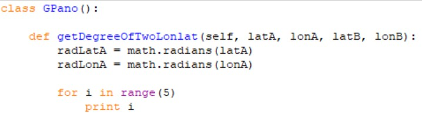

# What is indentation and control flow?
Indentation in Python refers to the blank between characters(spaces and tabs) that are used at the beginning of a statement. The statements with the same indentation belong to the same group called a suite, or code block.
```
if a > 0:
    print("a > 0")
    if s == "hello!":
        print(s)
```

Control flow is the order in which the program’s code executes. The control flow of a Python program is regulated by conditional statements, loops (`if`, `for` ,and `while`). For example, the variable defined in code blocks of `if`, `while`, and `with` cannot be access outside of those statements.

```
for i in range(5):
    print(i)
```
# Why uses Indentation to control flow
Python consider indent seriously. Specifically, it de demonstrates the code block and demonstrate the scope of the statements of the code block. The programmer can visually perceive the logic of the code. This convenience helps people understand the code intuitively. The use of indentation is the major feature of Python.  


# How to use indentation to control fow?
When implementing `class` and `def`, and writing other statements like `if`, `for`, and `while`, make sure put the statements inside the code blocks correctly.

