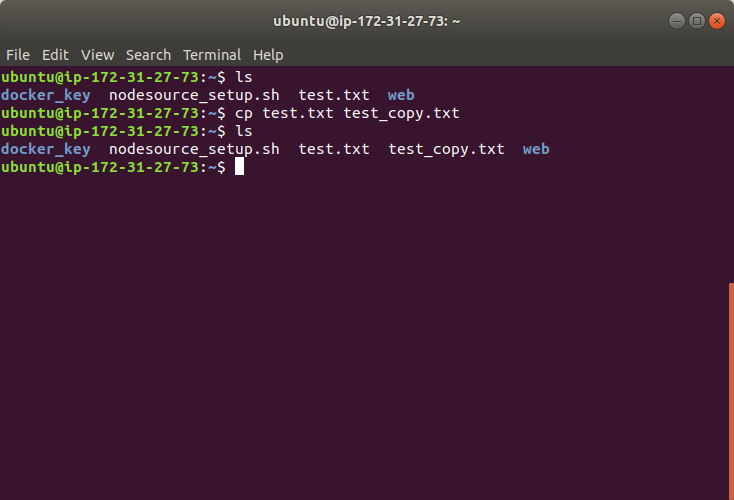

# cp  
`cp` is a command to do the copy files in Linux command line interface. It works as the copy-and-paste operation in Windows.  
Say we at the place where we open terminal at the first time. And we want to copy the file **test.txt**.  
  
We can type command `cp`. Then, we follow up the file name that we want to make a copy(**test.txt** in this case) and the name for new file copy. Here, we name it as **test_copy.txt**.  
And then, we use `ls` command to list files. We can see a file named **test_copy.txt** generated under current directory.  
  
How about for directories? Moreover, directory and its contained files? Say we have a directory named **docker_key**.  
And there is a file name **key.txt**.  
  
  
It also works for directory and files in that directory. The only thing you need to add is am extra parameter `-r` right after `cp`. Then, use `ls` command to list files. We can see a new directory generated and also its contained files.(Notice, since you still copy the directory, the only different is the name of directory).  
  

