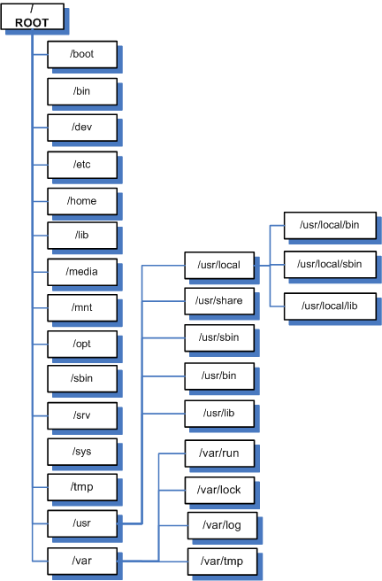
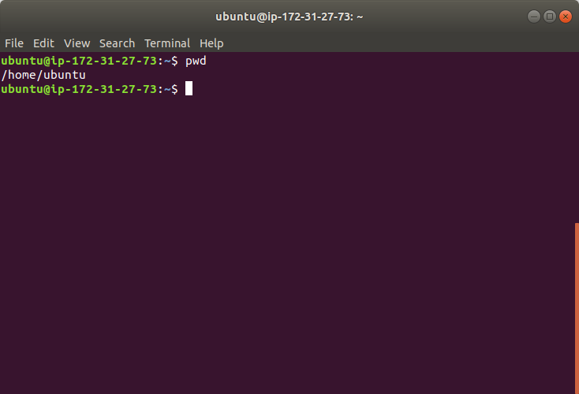

# file paths in Linux
This text illustrates a general concept of Linux system file structure.  
In Linux, there is no dirve **C**, **D** or something-liked in windows. What it has is a tree sturcture.  
The root point or top point of this tree is called **/**.  
A tree has its nodes, every non-leaf nodes represents a directory.  
Every leaf node is a file.  
Here is a sample graph for this structure(graph comes from [networkengineer.me]).  
  
# Example  
Now we open terminal and we use `pwd` to print the whole directory information of current stayed directory. The whole information here refers to its complete path from root **/** to the current directory node.  
  
You will see the result is **/home/ubuntu/**, it means the file path of current directory is start from root **/**, reach the **home/** directory node, and last the **ubuntu/** is there. The files under this directory are all leaf nodes and other directories are other non-lead directory nodes.
