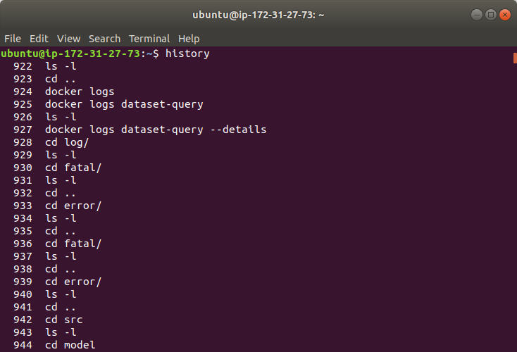

# history  
`history` has a simple meanning and function. It lists last 1000 commands you have typed in default.  
For example, you can see your historical commands when you type `history`:  
  
# Extra  
Notice that those history records are labeled with numbers. Those number can excceed number 1000, but it does not mean that it lists over 1000 commands. If you can scroll up to see the first historical command, you will see the number of that command is not 1. The difference between last command number and first command number should be around 1000.
