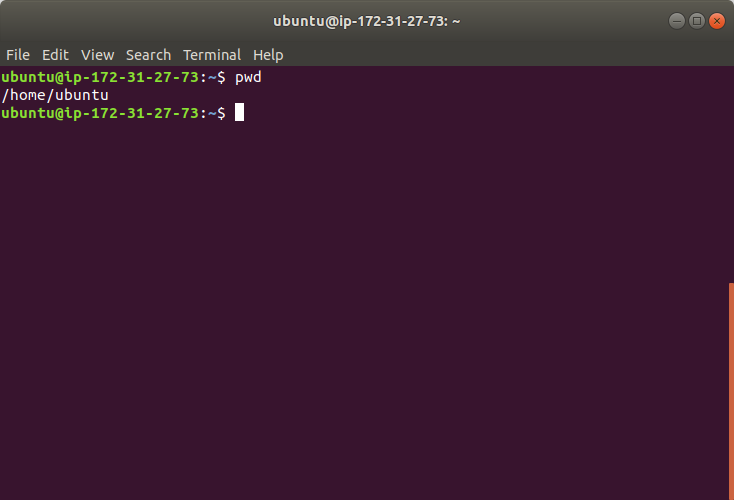

# home directory and ~  
When we open the terminal or command line interface, we are on a default directory which is assained by system.  
This default directory is usually represented by special character **~**, and we call it **home directory**. For example, you can the blue **~** followed with green characters indicate the current place you are:  
  
So, it means you are currently on a place what system calls it as **~**.
We start from the place shown on above picture and we first use command `pwd` to check the full directory path of where you current are:  
  
Ok, the **~** represents the directory **/home/ubuntu**. This is the home directory and a place we will stay when open the terminal.  
