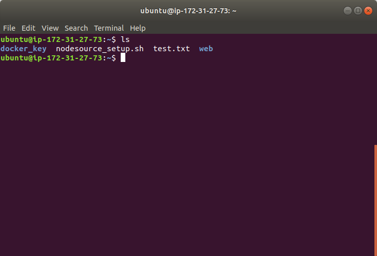
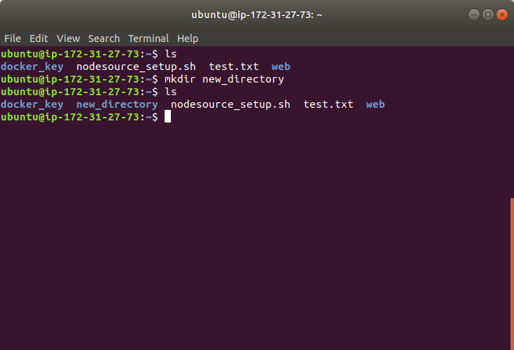

# mkdir  
This `mkdir` command is simple and it means **create a directory**. It is equvialent to right click-new-folder operation in Windows.  
Let's open terminal and use `ls` to see curret files and directories.  
  
Now we wanto to have a new directory, we name it as **new_directory**. So, we type following command and use `ls` again. Yes, we have the new directory named **new_directory**.  

