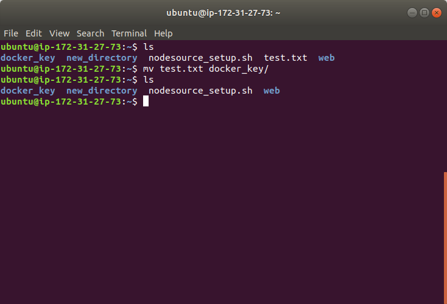
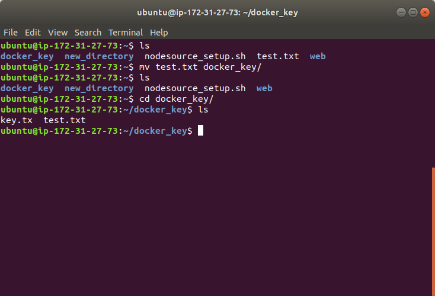

# mv  
This command moves files or directory to another place. You can think the cut-and-paste function in Winodws. Meanwhile, it has the rename function.  
Let's open a terminal and `ls` files and directories. We can see a file **test.txt**.  
  
Now we want to move it to directory **docker_key** and keep its name, so we type following command and we first use `ls` again to check current directory, we find **test.txt** is not here anymore.  
  
Then, `cd` to **docker_key** to check:  
  
Ok, we see **test.txt** file. Of course, you can have a different name whenever you do `mv` for the target file in destination.  
# Extra  
If you `mv` you file under you current directory, it won't allow you have same name this file. So, you need to give a different name and this command becomes a pure rename function now. You can have try to see the result. 
