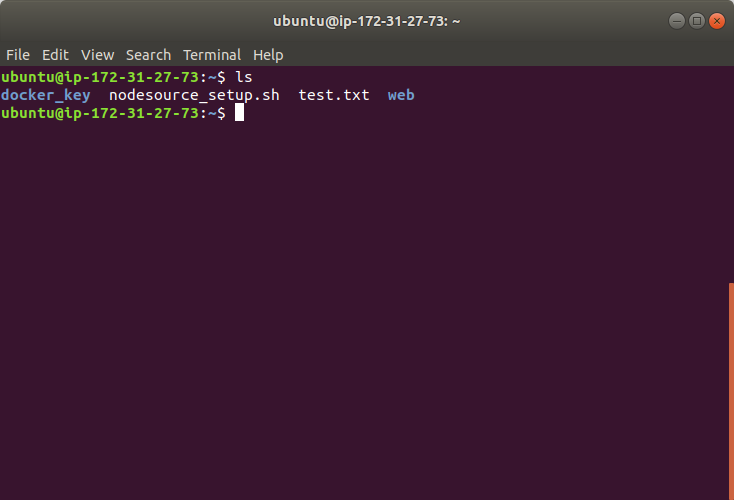
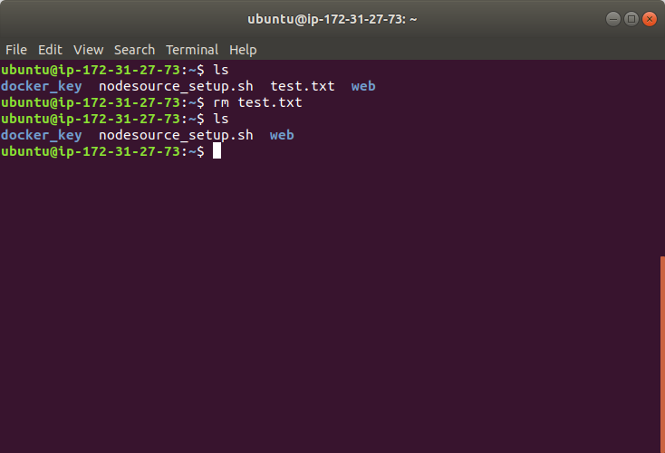
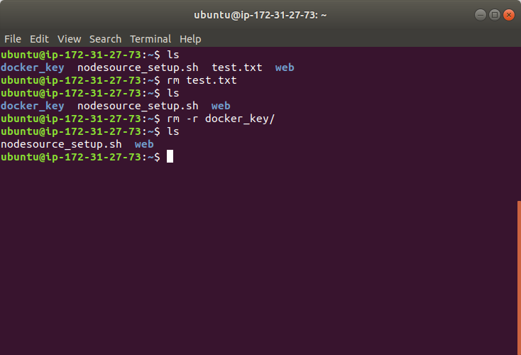

# rm  
This command is a remove or delete function in Linux. It is similar to operation right click-and-delete in Windows.  
Let's open terminal and `ls` files and directories.  
  
Say we now want to delet file **test.txt** and directory **docker_key**.  
For the first one, we can type following command and `ls` to check result:  
  
It is simple and straight forward. As for second one, you need to add a parameter `-r`. And `ls` to check result:   
    
# Extra  
DO SECOND CONSIDERATION WHENEVER YOU USE THIS COMMAND.
