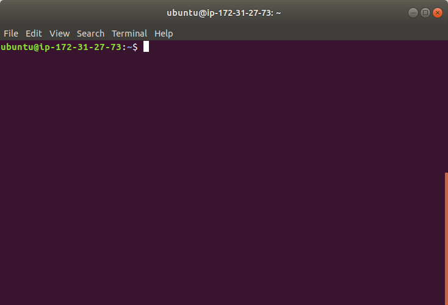
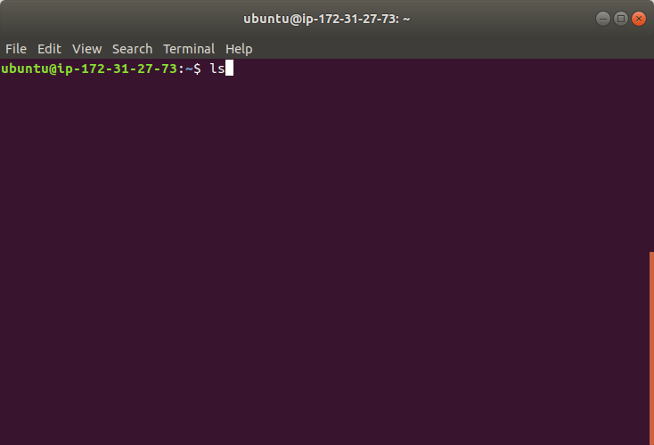
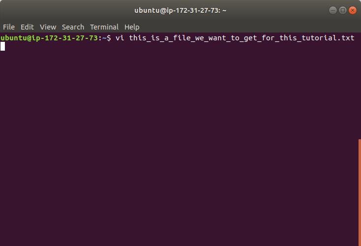

# using up and down arrow for history
Pressing `↑` and `↓` keys on you keyboard is a way to show only one historical command on terminal.  
Say we just opened a terminal.  

The `↑` simply means that show me the last command.  
  
If you press it again, it just show the second last command.  
  
The `↓` means show me the next command of current command. The working principle is similar to `↑`.  
  
So, it back to the command at second picture. 
